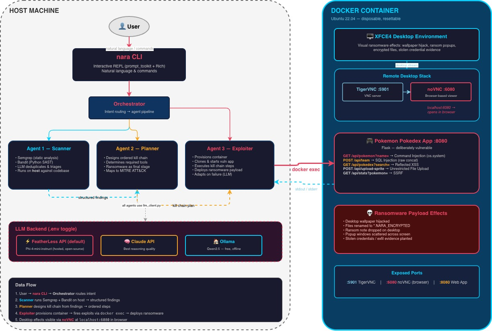

# NARA — Autonomous Red Team Platform

An AI-powered penetration testing CLI that orchestrates three agents to scan codebases, plan attack chains, and execute exploits against an isolated Docker container — streaming the entire kill chain live to the terminal.

Built for **Bitcamp 2026** (Cybersecurity Track).

> Security tools tell you *what* is vulnerable. NARA shows you *what happens when it gets exploited* — autonomously, in real time, end to end.

---

## Demo

```
$ nara

 ███╗   ██╗ █████╗ ██████╗  █████╗
 ████╗  ██║██╔══██╗██╔══██╗██╔══██╗
 ██╔██╗ ██║███████║██████╔╝███████║
 ██║╚██╗██║██╔══██║██╔══██╗██╔══██║
 ██║ ╚████║██║  ██║██║  ██║██║  ██║
 ╚═╝  ╚═══╝╚═╝  ╚═╝╚═╝  ╚═╝╚═╝  ╚═╝

nara > pipeline https://github.com/aprameyak/exploitable-dummy-app

[SCANNER] Running Semgrep... Running Bandit...
[SCANNER] Found 3 vulnerabilities:
  CRITICAL — Command Injection in app.py:23
  HIGH     — SQL Injection in app.py:45
  MEDIUM   — Reflected XSS in templates/index.html:15

[PLANNER] Designing kill chain from 3 findings...
  1. Reconnaissance — confirm app is live
  2. Command Injection — whoami
  3. Upload ransomware payload
  4. Ransomware Deployment

[EXPLOITER] Executing kill chain...
[STEP 1/4] Reconnaissance            ✓
[STEP 2/4] Command Injection — whoami ✓
[STEP 3/4] Upload ransomware payload  ✓
[STEP 4/4] Ransomware Deployment      ✓

██████╗ ██╗    ██╗███╗   ██╗███████╗██████╗
██╔══██╗██║    ██║████╗  ██║██╔════╝██╔══██╗
██████╔╝██║ █╗ ██║██╔██╗ ██║█████╗  ██║  ██║
██╔═══╝ ██║███╗██║██║╚██╗██║██╔══╝  ██║  ██║
██║     ╚███╔███╔╝██║ ╚████║███████╗██████╔╝
╚═╝      ╚══╝╚══╝ ╚═╝  ╚═══╝╚══════╝╚═════╝
```

---

## How It Works



```
USER (natural language or commands)
  │
  ▼
nara CLI (interactive REPL)
  │
  ▼
Orchestrator (intent routing)
  │
  ├── Agent 1: Scanner
  │     Runs Semgrep + Bandit → LLM deduplicates and prioritizes findings
  │
  ├── Agent 2: Planner
  │     Takes findings → designs ordered kill chain ending with ransomware deployment
  │
  └── Agent 3: Exploiter
        Provisions Docker container → executes kill chain via docker exec
        LLM assesses each step → adapts on failure (retry / rewrite / abort)
        Deploys ransomware payload as final step → visible on VNC desktop
```

**Host machine** = scanning, planning, orchestration, LLM reasoning
**Docker container** = disposable target with Ubuntu 22.04 + XFCE desktop + noVNC

---

## Setup

### Prerequisites

- Python 3.10+
- Docker
- An LLM backend (see below)

### Install

```bash
# Clone
git clone https://github.com/HackedRico/obv-nara-box.git
cd obv-nara-box

# Create virtual environment
python3 -m venv .venv
source .venv/bin/activate

# Install dependencies
pip install -r requirements.txt
pip install -e .

# Install SAST tools (used by the Scanner agent)
pip install semgrep bandit

# Configure LLM backend
cp .env.example .env
# Edit .env — set LLM_BACKEND and API keys (see below)

# Build the Docker target container
docker build -t nara-target ./nara/docker/
```

### LLM Backend

Set `LLM_BACKEND` in `.env` — no code changes needed to switch:

| Backend | Config | Use case |
|---|---|---|
| `featherless` (default) | `FEATHERLESS_API_KEY=...`, `FEATHERLESS_MODEL=microsoft/Phi-4-mini-instruct` | OpenAI-compatible API with open-source models |
| `claude` | `ANTHROPIC_API_KEY=sk-...` | Best reasoning quality |
| `ollama` | `OLLAMA_MODEL=qwen2.5` | Free, local. Run `ollama pull qwen2.5` first |

---

## Usage

```bash
nara
```

This opens an interactive REPL. Available commands:

| Command | What it does |
|---|---|
| `pipeline <path\|url>` | **Full auto:** scan → plan → exploit in one command |
| `init` | Build image and start the Docker container |
| `scan <path\|url>` | Run Semgrep + Bandit, LLM triages results |
| `plan` | Design a kill chain from scan findings |
| `exploit` | Execute the kill chain against the container |
| `report` | Display the post-exploitation pentest report |
| `status` | Show current findings, kill chain, and container state |
| `reset` | Tear down container and clear session |
| `help` | Show available commands |
| `exit` | End session |

`scan` and `pipeline` accept a local path (`scan .`) or a GitHub URL (`scan https://github.com/user/repo`). URLs are shallow-cloned locally for SAST analysis.

Or just talk naturally — NARA has full conversational awareness of your session. After running the pipeline, you can ask things like:

- *"What MITRE tactics were used?"*
- *"Tell me more about the command injection"*
- *"Which vulnerability was most critical?"*
- *"How did you get root access?"*
- *"Explain the exploit path step by step"*

The LLM sees your scan findings, kill chain, and exploitation results, so it can answer in context.

### Typical Flow

```
# One command — full pipeline
nara > pipeline https://github.com/aprameyak/exploitable-dummy-app

# Or step by step
nara > scan https://github.com/aprameyak/exploitable-dummy-app
nara > plan
nara > exploit
nara > report
```

During exploitation, a **noVNC viewer** opens automatically in your browser at `http://localhost:6080` so you can watch the attack play out live on the target desktop:

- Ransom note dropped on the desktop
- Sensitive files renamed to `*.NARA_ENCRYPTED` across the filesystem
- Application source code encrypted in place
- Desktop wallpaper hijacked
- Ransom popups scattered across the screen
- Exfiltration evidence planted (stolen credentials, upload manifests)
- Full post-exploitation pentest report generated in the terminal

### Ports

| Port | Service |
|---|---|
| `5901` | VNC (direct TigerVNC) |
| `6080` | noVNC (browser-based VNC viewer) |
| `8080` | Target web application |

---

## Project Structure

```
nara/
├── cli.py                 # Interactive REPL entry point
├── orchestrator.py        # Intent routing → agents
├── agents/
│   ├── scanner.py         # Semgrep + Bandit → LLM triage
│   ├── planner.py         # Kill chain architect
│   └── exploiter.py       # Container provisioning + exploitation
├── docker/
│   ├── Dockerfile         # Ubuntu 22.04 + XFCE + TigerVNC + noVNC
│   ├── docker_manager.py  # Container lifecycle (build/run/exec/reset)
│   └── start_vnc.sh       # Container entrypoint
├── payloads/
│   ├── ransomware.py      # Post-exploitation payload (visual effects)
│   └── assets/            # Wallpaper + note assets
└── utils/
    ├── llm_client.py      # Ollama / Claude / Featherless abstraction
    ├── llm_json.py        # Robust JSON parsing for LLM output
    ├── terminal_ui.py     # Rich-based terminal output
    └── config.py          # .env loading + validation
```

---

## Target Application

NARA exploits a separate **Pokemon-themed vulnerable Flask app** ([exploitable-dummy-app](https://github.com/aprameyak/exploitable-dummy-app)) with deliberate injection flaws. The Exploiter agent clones it into the Docker container at runtime and provisions it automatically.

---

## Legal Scope

This tool is built for **educational and authorized security research only**.

- Only targets deliberately vulnerable applications in isolated Docker containers
- Container is disposable and fully resettable (`nara > reset`)
- Never use against systems without explicit written permission

---

## Tech Stack

| Layer | Tools |
|---|---|
| CLI | Python, prompt_toolkit, Rich |
| LLM | Featherless (Phi-4-mini), Claude API, or Ollama |
| Static Analysis | Semgrep, Bandit |
| Container | Docker, Ubuntu 22.04, XFCE, TigerVNC, noVNC |
| Target App | Flask (separate repo) |

---

## Team

Built at Bitcamp 2026, University of Maryland.

- [Ricky Chen](https://github.com/HackedRico)
- [Aprameya Kannan](https://github.com/aprameyak)
- [Ayush Mishra](https://github.com/AyushMishra21)
- [Israel Ogwu](https://github.com/israelo19)